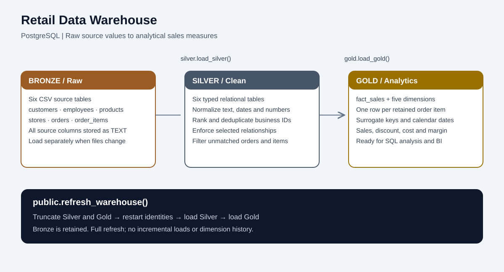
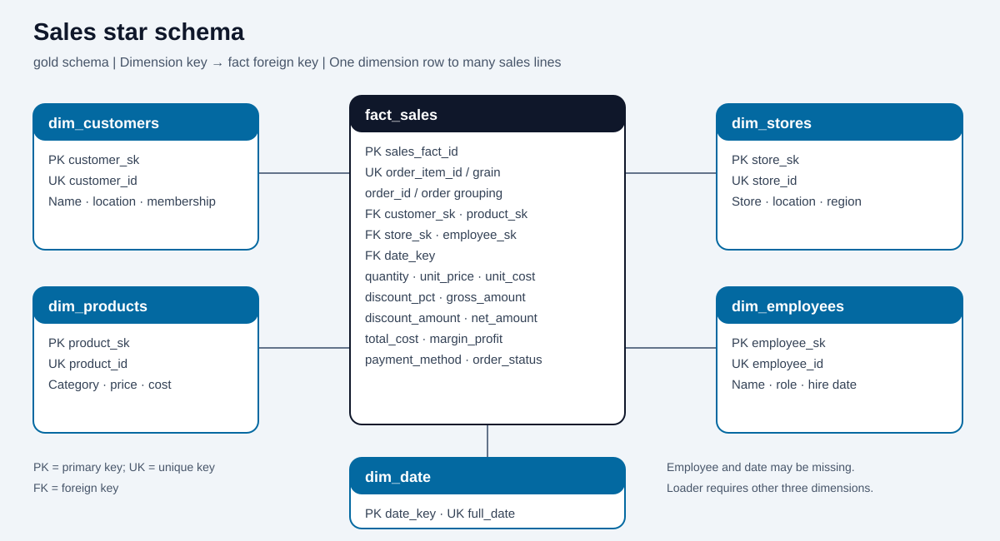

# Retail Data Warehouse

**A PostgreSQL warehouse that turns raw retail CSV data into a dimensional sales model.**

This project implements a Bronze → Silver → Gold pipeline using SQL and PL/pgSQL stored procedures. It brings customers, employees, products, stores, orders, and order items together to support sales, discount, cost, and margin analysis across time and business dimensions.

## Architecture



| Layer | Purpose | Implementation |
|---|---|---|
| Bronze | Preserve source values | Six tables with all source columns stored as `TEXT`; CSV loading is separate from refreshes. |
| Silver | Clean and standardize | Six typed tables, business-key deduplication, normalized values, primary keys, selected foreign keys, and validation constraints. |
| Gold | Support analytics | Five dimensions and `gold.fact_sales`, with surrogate keys, precomputed line measures, and indexes on fact foreign keys. |

The final SQL is preserved as supplied. This repository documents the implemented behavior; it does not claim production deployment, performance benchmarks, or verified source-data results.

## Repository structure

```text
retail-data-warehouse/
├── README.md
├── .gitignore
├── sql/
│   ├── retail_data_warehouse.sql
│   ├── load_bronze.psql
├── data/
│   └── README.md
└── docs/
    ├── architecture.svg
    ├── star_schema.svg
    ├── diagrams.md
    └── publishing.md
```

## Cleaning logic

- **Text and missing values:** trim whitespace, apply title casing where appropriate, and convert recognized placeholders such as `n/a`, `null`, `none`, and `-` to SQL `NULL` in selected fields.
- **Contact details:** lowercase emails, repair specific missing-`@` patterns for common providers, and retain addresses matching the basic `%@%.%` pattern. Customer phones are reduced to digits; empty results remain possible and are flagged by validation.
- **Dates:** parse year-first numeric dates, day/month or month/day forms, and supported month-name forms. Ambiguous numeric dates default to month-first; unrecognized formats become `NULL`.
- **Categories and geography:** unify country aliases, MENA region labels, product categories, payment methods, and active/inactive flags. A leading `I ` is removed from product names when present.
- **Numeric fields:** strip currency/non-numeric characters from selected monetary fields and convert negatives to absolute values. Quantities are converted to absolute integers, then zero or missing quantities are excluded.
- **Discounts:** interpret percent strings and numbers above one as percentages, take absolute values, and cap at one. Recognized missing-value strings become zero; actual SQL nulls reach `LEAST(NULL, 1.0)`, which produces one (100%) in PostgreSQL. This edge case is retained from the original script and should be corrected before relying on null-discount records.
- **Deduplication:** use `ROW_NUMBER()` by business ID. Customer and employee records favor completeness and recent dates; products favor price/cost completeness; orders favor recent order dates. Stores and items also use ranked selection. Exact ranking ties do not have a guaranteed winner.
- **Relationships:** orders require matching customers and stores; items require matching orders and products. Missing employees are retained as null references through left joins. Rejected relationships are excluded rather than written to a quarantine table.

## Stored procedures and refresh lifecycle

| Procedure | Responsibility |
|---|---|
| `silver.load_silver()` | Insert cleaned and deduplicated Bronze records into Silver in dependency order. |
| `gold.load_gold()` | Generate the date dimension, populate entity dimensions, and calculate sales facts. |
| `public.refresh_warehouse()` | Truncate Silver and Gold with `RESTART IDENTITY`, then call both loaders. Bronze is retained. |

Use the master procedure for ordinary refreshes. The individual loaders insert rows and are not safe to repeat on populated target tables. This is a **full rebuild**, with no incremental loading or historical dimension tracking. Surrogate keys can change after a refresh and should not be treated as permanent external identifiers.

## Star schema



**Fact grain: one row per retained order-item line**, identified by unique `order_item_id`. `sales_fact_id` is the generated primary key; `order_id` remains in the fact as a degenerate dimension for grouping and distinct order counts.

| Dimension | Key | Analytical attributes |
|---|---|---|
| `gold.dim_customers` | `customer_sk` | Customer business ID, name, geography, membership, signup and birth dates |
| `gold.dim_products` | `product_sk` | Product business ID, category, subcategory, supplier, current price/cost, active flag |
| `gold.dim_stores` | `store_sk` | Store business ID, geography, region, opening date, size |
| `gold.dim_employees` | `employee_sk` | Employee business ID, name, role, hire date, salary, email |
| `gold.dim_date` | `date_key` (`YYYYMMDD`) | Calendar year, quarter, month, day, ISO weekday, Saturday/Sunday weekend flag |

Dates span complete years from the earliest to latest valid Silver order date, with a 2020–2030 fallback when no dates exist. Missing order dates produce null fact date keys. Employee keys may also be null. All fact foreign-key columns are nullable in the DDL, although the loader's inner joins require customer, product, and store matches.

## Measures and business interpretation

Let `q` be quantity, `p` effective unit price, `c` effective unit cost, and `d` effective discount fraction. Price falls back from item price to product price to zero; cost falls back from product cost to zero; Gold uses `COALESCE` to replace any remaining null discount with zero.

| Measure | Calculation |
|---|---|
| `quantity` | Retained item quantity |
| `gross_amount` | `ROUND(q * p, 2)` |
| `discount_amount` | `ROUND(q * p * d, 2)` |
| `net_amount` | `ROUND(q * p * (1 - d), 2)` |
| `total_cost` | `ROUND(q * c, 2)` |
| `margin_profit` | `ROUND(q * p * (1 - d) - q * c, 2)` |

Amounts and quantity can be summed across fact rows. Prices and discount fractions should not be summed. Use `COUNT(DISTINCT order_id)` for orders and `SUM(margin_profit) / NULLIF(SUM(net_amount), 0)` for aggregate margin rate. Independently rounded components can differ by a cent.

All retained order statuses are loaded, including any cancelled or returned statuses in the source. Filter by a defined business policy before calling totals recognized revenue. Cost uses the current product record, not historical cost. Missing costs represented as zero can overstate margin. The script strips `JOD` text but does not implement currency conversion or a currency dimension; combine values only when their currency is consistent.

## Technologies and skills demonstrated

- **PostgreSQL and SQL:** schemas, typed tables, identity keys, constraints, indexes, joins, CTEs, window functions, regular expressions, and date generation.
- **PL/pgSQL:** modular stored procedures and a coordinated refresh workflow.
- **Data engineering:** layered warehouse design, CSV ingestion, normalization, deduplication, dependency-aware loading, and quality checks.
- **Dimensional modeling:** business versus surrogate keys, order-line fact grain, conformed analytical dimensions, and additive measures.
- **Portfolio communication:** reproducible run instructions, schema visuals, explicit assumptions, and version-control hygiene.
