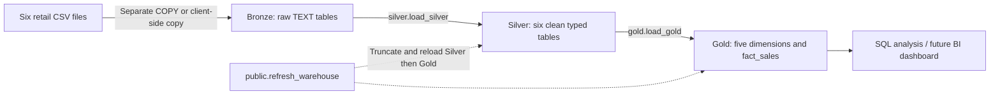
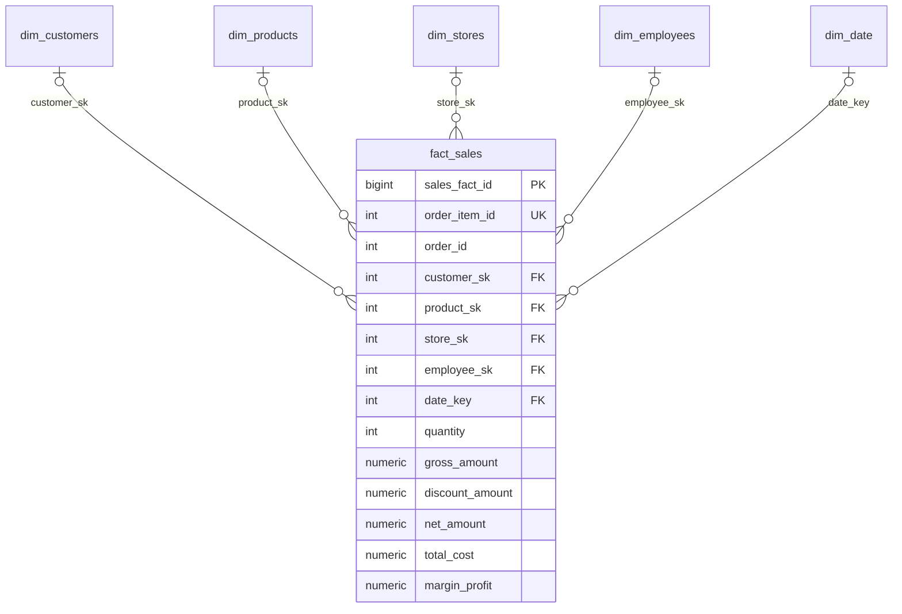

# Diagram sources

The SVG files render directly in the README. These Mermaid definitions provide editable versions of the same architecture and relationships.

## Architecture

## Star schema

All fact foreign keys are nullable in the DDL. The loader requires customer, product, and store matches; employee and date keys can remain null.

